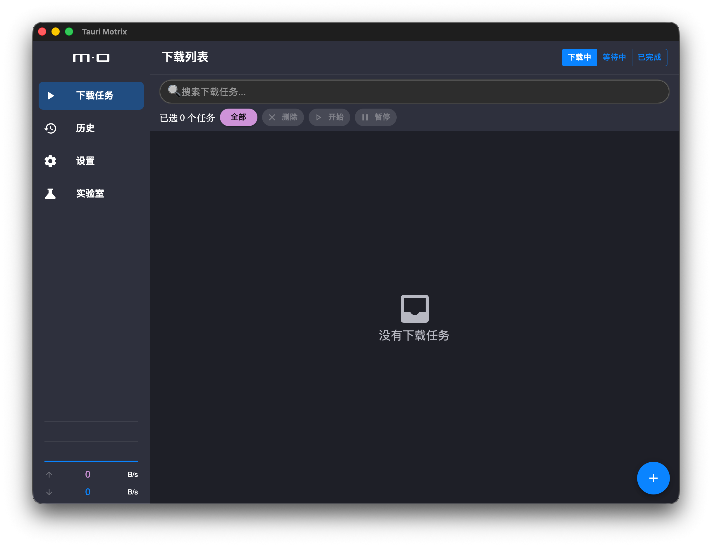
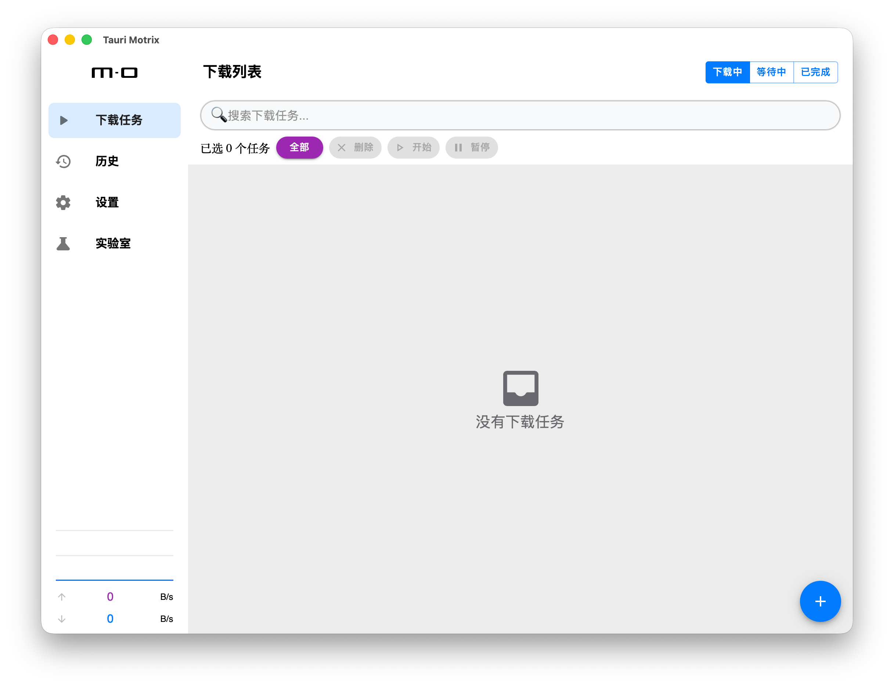

# tauri-motrix

> This project is based on the original **Taoister39/tauri-motrix** and extended/modified for my own needs.
> Huge thanks to the original author and community.
>
> Upstream repository: https://github.com/Taoister39/tauri-motrix

Tauri Motrix is a full-featured download manager built with Tauri. It is a modernized, lightweight re‑implementation inspired by the original [Motrix](https://github.com/agalwood/Motrix).

## Preview

| Dark | Light |
| --- | --- |
|  |  |

## Features

- Material Design UI (MUI)
- Multi‑threaded downloads
- Speed limit
- BitTorrent (aria2)
- Lightweight desktop app

## Development

Make sure you have the Tauri prerequisites installed. Then run:

```bash
pnpm i
pnpm check
pnpm tauri dev
```

## Notes

- If you are on **Windows ARM** or **Linux ARM**, install **LLVM (clang)** and set the related environment variables. The `ring` crate requires `clang` for those targets.
- The `pnpm check` step downloads and prepares the aria2 sidecar binary and locale files.

## Acknowledgements

Thanks to the following projects for inspiration and reference:

- [Taoister39/tauri-motrix](https://github.com/Taoister39/tauri-motrix)
- [Motrix](https://github.com/agalwood/Motrix)
- [aria2](https://github.com/aria2/aria2)
- [Clash Verge](https://github.com/clash-verge-rev)

## License

GPL-3.0 License. See [License](./LICENSE).
